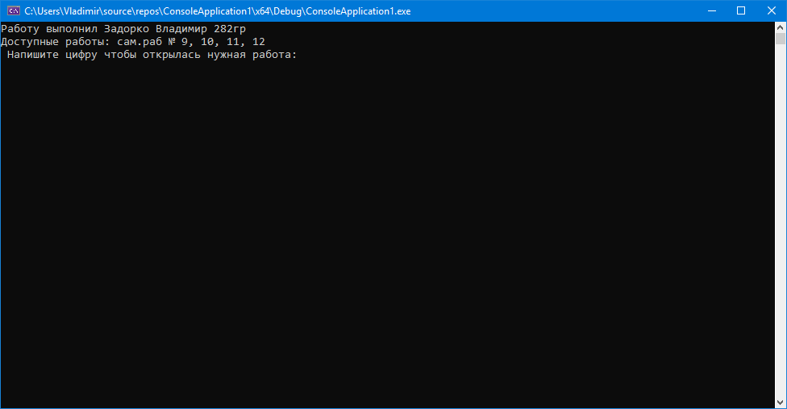
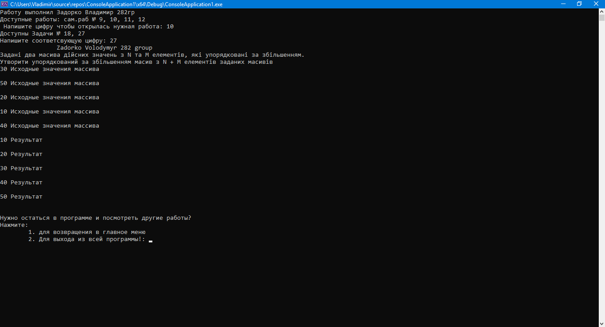

# Задорко Володимир 282гр
# https://youtu.be/O-BChdO7scU
Либо зайдите в каталог: media/video.mp4
# Видео-обзор программы (без звука)

Старт программы

.png)
Cамост. работа 9 Задача 13

Cамост. работа 9 Задача 16

Cамост. работа 10 Задача 18

Cамост. работа 10 Задача 27

P.S: Сам.раб 11, 12 допишу как изучим матрицы(ибо там задачи даны на эту тему)
